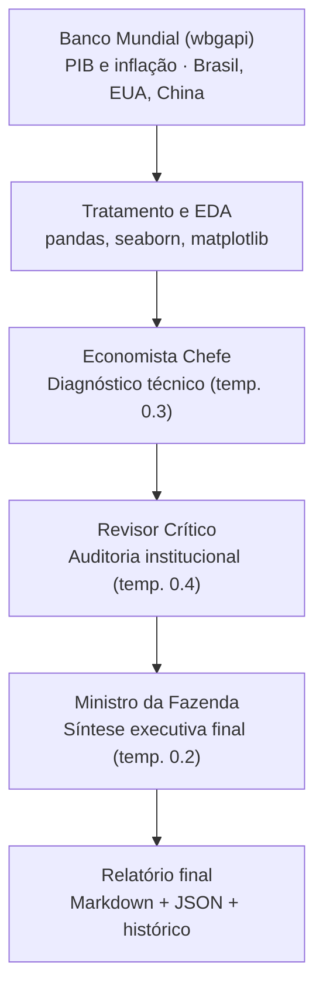

# 🏛️ Comitê Multiagente: Debate Estrutural da Economia Brasileira

Sistema que utiliza Inteligência Artificial como motor de raciocínio crítico em cadeia para simular um comitê de política econômica. O pipeline analisa dados macroeconômicos reais do Brasil — usando potências globais apenas como contexto exógeno — para produzir recomendações de política pública viáveis, tanto tecnicamente quanto politicamente.

---

## 🎯 O Problema

Ferramentas de IA generativa costumam responder perguntas econômicas com um único ponto de vista — geralmente o mais "tecnicamente correto", mas alheio à viabilidade política e social de aplicá-lo. Um economista ortodoxo sozinho recomendaria corte de gastos; sem um contraponto institucional, essa recomendação nunca sobreviveria ao Congresso.

Este projeto testa uma hipótese: **um debate estruturado entre agentes de IA com personas e temperaturas diferentes produz uma recomendação final mais equilibrada do que uma única chamada de modelo.**

## 💡 Visão e Viés do Sistema

O projeto foi desenhado com um viés **intencional e declarado 100% pró-Brasil**:

- **O núcleo:** os dados de PIB e inflação brasileiros são o centro de toda a análise.
- **Variáveis exógenas:** EUA e China não são modelos a serem copiados. Eles entram no sistema exclusivamente como fontes de choques externos (ex: juros americanos pressionando câmbio, desaceleração chinesa afetando exportações).
- **Critério de sucesso:** as recomendações finais convergem unicamente para o que melhora o cenário interno brasileiro.

## ⚙️ Arquitetura do Pipeline



O fluxo integra Engenharia de Dados (ETL), Análise Exploratória e orquestração de agentes autônomos:

1. **Extração (ETL):** coleta automatizada via API do Banco Mundial (`wbgapi`) para os últimos 10 anos, com transformação estrutural usando `pandas` (indicadores `NY.GDP.MKTP.KD.ZG` e `FP.CPI.TOTL.ZG`, para Brasil, EUA e China).
2. **Visualização (EDA):** painéis comparativos das trajetórias macroeconômicas com `seaborn` e `matplotlib`.
3. **Debate multiagente (Google Gemini):**
   - 📊 **Economista Chefe** — diagnóstico quantitativo e pragmático, focado no mercado interno.
   - 🏛️ **Revisor Crítico** — audita a viabilidade política e institucional, aponta reações do Congresso, rigidez fiscal e efeitos colaterais.
   - 🔨 **Ministro da Fazenda** — árbitro final, entrega a síntese executiva equilibrando técnica e realidade política.
4. **Governança de dados:** rastreabilidade completa com salvamento de cada execução em `.md` e `.json`, e monitoramento analítico do volume argumentativo dos agentes ao longo do tempo.

## 🧠 Decisões de Engenharia

Algumas escolhas técnicas que valem destaque num code review:

- **Temperature calibrada por papel, não fixa no pipeline inteiro.** O Economista Chefe roda em `0.3` (rigor analítico), o Revisor Crítico em `0.4` (mais liberdade para contra-argumentar) e o Ministro em `0.2` (decisão final precisa ser estável e determinística, não "criativa").
- **Chamadas stateless entre agentes.** Cada agente recebe apenas o texto de saída do anterior via prompt — não há histórico de conversa acumulado — o que torna cada etapa auditável e substituível isoladamente.
- **Separação entre lógica de dados e lógica de exibição.** `rodar_pipeline_multiagente()` devolve um dicionário puro (`economista`, `critico`, `sintese`); a formatação em Markdown para exibição no notebook é uma camada à parte, o que facilita reutilizar o pipeline em outro contexto (ex: script `.py`, API, dashboard).
- **Migração de SDK em produção.** O projeto começou com `google-generativeai` (deprecado) e foi migrado para o novo `google-genai`, atualizando também o modelo para `gemini-3.5-flash`.
- **Histórico versionado, não só o último resultado.** Cada execução salva `.md` (leitura humana) e `.json` (metadados + reprocessamento programático), permitindo montar depois um gráfico comparando o "tamanho argumentativo" de cada agente ao longo de múltiplas execuções.

## 🚀 Stack Tecnológico

- **Core:** Python
- **Dados & Analytics:** pandas, matplotlib, seaborn, wbgapi
- **IA & Orquestração:** google-genai (Gemini)

## 💻 Como Executar

1. Clone o repositório e abra o arquivo `multi_agent_debate.ipynb` (Google Colab ou Jupyter).
2. Instale as dependências:
   ```bash
   pip install wbgapi pandas google-genai matplotlib seaborn
   ```
3. Configure sua API Key do Google AI Studio (`GEMINI_API_KEY`):
   - **No Colab:** utilize o gerenciador de *Secrets* (ícone 🔑).
   - **Localmente:** o script solicitará a inserção da chave de forma segura no terminal.
4. Execute as células em ordem para rodar o pipeline automatizado.

## 🔭 Roadmap

**Curto prazo — mais dados, mais profundidade.** Hoje o sistema roda só com PIB e inflação. Os próximos indicadores planejados:
- Câmbio (USD/BRL)
- Taxa de desemprego
- Dívida pública / PIB
- Taxa Selic

**Experimentos de robustez de IA (pesquisa):**
- **Testes de aleatoriedade estrutural:** rodar o pipeline múltiplas vezes comparando o comportamento dos agentes em 5 eixos econômicos distintos (política fiscal, política monetária, câmbio, reformas estruturais, produtividade industrial), para medir o quanto a recomendação final é consistente ou sensível a variação.
- **Experimento do "Ministro humanizado":** injetar contexto pessoal irrelevante (ex: detalhes de vida pessoal fictícios) no system prompt do agente final, para investigar se isso enviesa uma decisão que deveria ser puramente técnica — um teste de consistência e robustez do agente arbitrador.

**Produto:**
- Permitir escolha de outros países como fonte de variáveis exógenas.
- Dashboard interativo do histórico de execuções.

## 📌 Status

Projeto pessoal, em evolução ativa.
